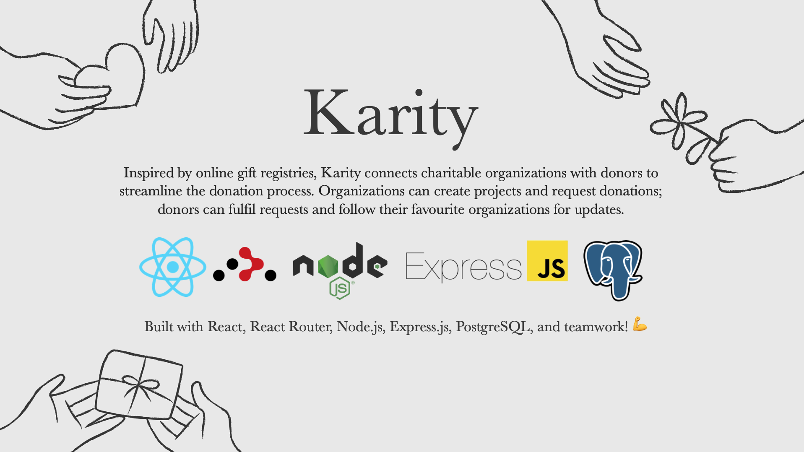

# Karity: Charity Registry

Final project for **Lighthouse Labs Full-Stack Web Development Bootcamp** created by [Kevin Lobsinger](https://github.com/Klobsinger), [Andrijana Zivkovic](https://github.com/andrijana85), and [Rebecca Ariss](https://github.com/rebeccaariss) (putting the _K_, _A_, and _R_ in **Karity**)! 👩🏼‍💻👨🏼‍💻👩🏼‍💻

## Meet the Karity Developer Team

## The Tech Stack
#### Front-end:
- React
- React Router
- CSS

#### Back-end:
- Node
- Express
- PostgreSQL

## Project Description
- A platform for charities/organizations to specify exactly what they need (specific items/resources, money, or volunteer time)
- Donors can choose and fulfill needs requests for their favourite organizations and follow organizations for updates
- Charities are more effective if they can directly ask for and get what they need
- Users can feel good about making a real difference
- This platform avoids the donation of duplicate items, potentially resulting in wasted resources
- Users can feel more socially connected to the organizations they care about
- Functions much like an online baby or wedding registry
  - Organizations list items that they need, donors can "claim" those items and check them off of the list when there is a confirmation of donation

### Examples
**Problem:** A food bank might have a ton of peanut butter but not enough dry cereal to meet the needs of their community.
- **Solution:** They can list the number of cereal boxes needed and keep track of how many have been donated since the request was posted.

**Problem:** An animal shelter might have a lot of cat litter but needs a large donation of kitten milk replacement for many incoming kittens.
- **Solution:** They can list the number of items needed and keep track of how many have been donated since the request was posted.

**Problem:** An environmental organization might require volunteers for a petition, litter cleanup, protest, etc.
- **Solution:** They can list roughly how many hours would be required of volunteers to complete a project (or roles that need to be held over a longer period of time).

**Problem:** An advocacy group might have an active fundraiser to support the needs of a family affected by extreme medical debt.
- **Solution:** They can post an active fundraiser which keeps track of the overall goal for funding & how much has been raised to date.

## Getting Started

1. Create the `.env` by using `.env.example` as a reference: `cp .env.example .env`
2. Update the .env file with your correct local information 
  - username: `labber` 
  - password: `labber` 
  - database: `midterm`
3. Install dependencies: `npm i`
4. Fix to binaries for sass: `npm rebuild node-sass`
5. Reset database: `npm run db:reset`
  - Check the db folder to see what gets created and seeded in the SDB
7. Run the server: `npm run local`
  - Note: nodemon is used, so you should not have to restart your server
8. Visit `http://localhost:8080/`

## Warnings & Tips

- Do not edit the `layout.css` file directly, it is auto-generated by `layout.scss`.
- Split routes into their own resource-based file names, as demonstrated with `users.js` and `widgets.js`.
- Split database schema (table definitions) and seeds (inserts) into separate files, one per table. See `db` folder for pre-populated examples. 
- Use helper functions to run your SQL queries and clean up any data coming back from the database. See `db/queries` for pre-populated examples.
- Use the `npm run db:reset` command each time there is a change to the database schema or seeds. 
  - It runs through each of the files, in order, and executes them against the database. 
  - Note: you will lose all newly created (test) data each time this is run, since the schema files will tend to `DROP` the tables and recreate them.

## Dependencies

- Node 10.x or above
- NPM 5.x or above
- PG 6.x
